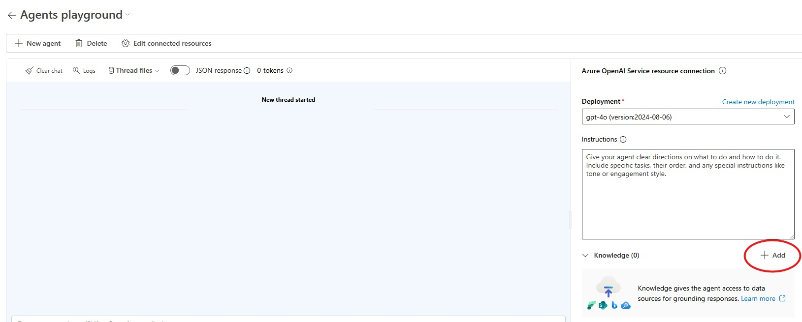

# Prerequisites

Before attending the Intelligent App Development Workshop, please ensure you have the following prerequisites in place:

1. **Azure account**: A Microsoft Azure account with an active subscription. If you don't have one, sign up for a [free trial](https://azure.microsoft.com/en-us/free/).
1. **Azure subscription with access enabled for the Azure AI Foundry** - For more details, see the [Azure AI Foundry documentation on how to get access](https://learn.microsoft.com/en-us/azure/ai-studio/what-is-ai-studio#how-to-get-access). 

## Development Environment Setup

You have the option of using [Github Codespaces](https://docs.github.com/en/codespaces/getting-started/quickstart) or your local development environment.

### Using Github Codespaces
If using Github Codespaces all prerequisites will be pre-installed.

Click on the **"<> Code"** button. Then click on the **"Create codespace on main"** button.
### Using local development environment

If you prefer using a computer with using a local development environment, the following pre-requisites need to be installed:

1. **Git**: Ensure you have [Git](https://git-scm.com/downloads) installed on your computer.
1. **Azure CLI**: Install the [Azure Command-Line Interface (CLI)](https://docs.microsoft.com/en-us/cli/azure/install-azure-cli) to interact with Azure services and manage resources from the command line.
1. **.NET 9.0 SDK**: install [.NET SDK](https://dotnet.microsoft.com/en-us/download) to build and run .NET projects.

Next you will need to clone this repo using:

```bash
git clone https://github.com/ActiveSolution/active-aiacademy-semantic-kernel.git
```

## Initial Setup

1. Go to the pre-created [Azure AI Foundry Hub](
https://ai.azure.com/managementCenter/hub/overview?wsid=/subscriptions/473daaa7-1d63-4345-902f-f2d98875287b/resourceGroups/rg-skworkshop-sdc/providers/Microsoft.MachineLearningServices/workspaces/hub-skworkshop-sdc&tid=e40b4f18-1174-4423-b6bd-9de65554c52f)

1. Create an Azure AI Foundry project in this the hub:

    1. Click **New Project**
    1. Enter a name for your project
    1. Click **Create**

1. Store AI Foundry settings in `appsettings.json`
    1. In Azure AI Foundry, copy the API key and use it as the **apiKey** value in the `AIFoundryProject` element of `appsettings.json`.
    1. Under **Included capabilities** choose **Azure OpenAI Service** and copy the endpoint. Use it as the **endpoint** value in the `AIFoundryProject` element of `appsettings.json`.
    1. On the right side of the screen, locate the **Project connection string** (within **Project Details**) and use it as the **connectionString** value within the `AIFoundryProject` element in `appSettings.json`.
            

1. Deploy a model in Azure AI Foundry:

    1. Click the **Models + endpoints*** tab (sidebar, left) to view currently deployed models.
    1. If your desired model is not deployed, click on **Deploy Model** then select to **Deploy Base Model**.
    1. You will need a chat completion model. For this workshop we recommend using `gpt-4o`. Select `gpt-4o` from the drop down and click **Confirm**.
    1. Click **Customize** and choose the `2024-11-20` model. At the time of this workshop, this is the [latest version](https://learn.microsoft.com/en-us/azure/ai-services/agents/how-to/tools/bing-grounding?pivots=overview#setup) that integrates with Azure AI Agent Service, which we will use in Lesson 6.
    1. Adjust the Tokens per Minute Rate Limit to at least 250 requests per minute (RPM)
    1. Click **Deploy**.
        
    1. Use the **Deployment Name** value (e.g. gpt-4o) as the **deploymentName** value within the `AIFoundryProject` element in the `appsettings.json` file.
    1. Wait a few minutes after deployment to allow the API to come online.

1. Create Agents connection to Grounding with Bing Search resource:

    1. Click on **Playgrounds** on the left side.
    1. In the Agents playground box, click **Try the Agents playground**.
    1. Choose your Azure OpenAI Service instance in the dropdown and click **Let's go**.
    1. Scroll down and find the `Knowledge` section on the right. Click **Add**.
        
    1. Click **Grounding with Bing Search**.
    1. Click **Create connection**.
    1. Find the resource you created and click **Add connection**.
    1. Click **Connect**.
    1. From the Agents playground page, locate the **Knowledge** section and copy the name of the connection you just created and paste it as the **groundingWithBingConnectionId** value within the `AIFoundryProject` element in the `appSettings.json` file.

1. Additionally, we need to an API Key to be able to get stock prices from [polygon.io](https://polygon.io/dashboard/login). This value will be needed for [Lesson 3](lesson3.md). You will get the API key from Jakob, if he's in a good mood.
